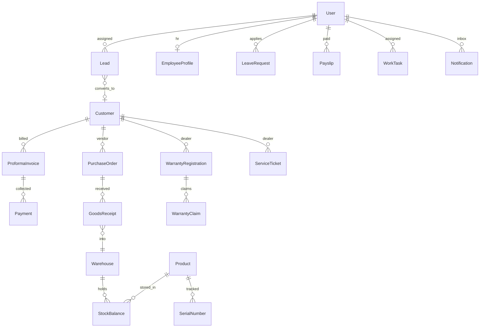

# SPARS ERP – Enterprise Company Management

Kalpna Traders operating system on the existing stack: **Next.js 15 + Django REST + PostgreSQL**, deployed on **Vercel + Render + Neon**.

Roles: `admin` (MD), `sales`, `accountant`, `hr`, `manager`, `technician`, `dealer`.

---

## 1. Folder structure

```
backend/
  accounts/          # users, JWT, roles
  customers/         # dealers + vendors
  products/          # catalog + SKU / min stock
  invoices/          # quotation + tax invoice PDF
  attendance/
  company/           # settings, calendar, public page
  reports/
  activity/          # audit log
  enterprise/        # all new ERP modules (this release)
    models.py
    serializers.py
    views.py
    urls.py          # mounted at /api/erp/
    services.py      # stock, payroll, lead score
    pdfs.py          # receipt + payslip
    notify.py
  core/numbering.py
frontend/
  app/(dashboard)/   # staff ERP pages
  app/(portal)/portal/  # dealer portal
  app/(auth)/dealer-login/
  lib/enterprise.ts
```

---

## 2. Database schema (PostgreSQL)

Indexed for 500+ staff and 1000+ dealers (`status`, `assigned_to`, `created_at`, unique document numbers).

| Table | Key fields |
|---|---|
| **crm_lead** `enterprise_lead` | lead_number UK, company, contact, mobile, source, status, assigned_to, product_interest, next_follow_up, priority_score, converted_dealer |
| **lead notes / followups** | history + reminders |
| **warehouse** | code UK, city |
| **stock_balance** | unique(warehouse, product), qty |
| **stock_movement** | in / out / transfer, movement_number |
| **serial_number** | serial UK, status, warehouse, dealer, invoice |
| **product_batch** | unique(product, warehouse, batch_no) |
| **purchase_order + items** | draft → sent → approved → received → closed |
| **goods_receipt + items** | GRN posts stock in |
| **purchase_bill / vendor_payment** | vendor dues |
| **payment** | receipt_number, customer, invoice, mode, kind, amount |
| **department / employee_profile / employee_document** | HR file |
| **leave_balance / leave_request** | CL / SL / EL, pending → manager → admin |
| **salary_structure / payroll_run / payslip** | PF ESI TDS |
| **warranty_registration / warranty_claim** | serial UK, claim workflow |
| **service_ticket / ticket_update** | technician, origin=dealer_portal |
| **work_task / task_comment** | due_date, priority |
| **doc_folder / managed_document / document_version** | DMS |
| **notification** | in-app + email flag |

Existing tables unchanged except:

- `accounts_user.role` extra choices + `manager` + `linked_dealer`
- `products_product.sku, min_stock, reorder_level, warranty_months, is_serialized`

---

## 3. ER diagram



---

## 4. REST API (prefix `/api/erp/`)

| Resource | Endpoints |
|---|---|
| CRM | `GET/POST /leads/` `PATCH /leads/:id/` `POST .../notes/` `POST .../followups/` `POST .../convert_dealer/` `GET .../pipeline/` `GET .../export/` |
| Inventory | `/warehouses/` `/stock/` `/stock/dashboard/` `/stock-moves/move/` `/serials/` `/batches/` |
| Purchase | `/purchase-orders/` `POST .../submit/` `POST .../approve/` `/grn/` `/purchase-bills/` `/vendor-payments/` |
| Collections | `/payments/` `/payments/dashboard/` `GET .../pdf/` `GET .../export/` |
| HR | `/departments/` `/employees/` `/employee-docs/` `/leave-balances/` `/leaves/` `POST .../manager_review/` `POST .../admin_review/` |
| Payroll | `/salary-structures/` `/payroll/` `POST .../process/` `/payslips/:id/pdf/` `/payroll/export/` |
| Warranty | `/warranties/` `/warranty-claims/` `POST .../set_status/` |
| Service | `/service-tickets/` `POST .../assign/` `POST .../updates/` |
| Tasks | `/tasks/` `/tasks/mine/` |
| DMS | `/folders/` `/documents/` |
| Notify | `/notifications/` `unread_count` `read` `read_all` |
| MD | `GET /md/` |
| AI | `GET/POST /ai/` |
| Dealer portal | `/portal/home/` `products/` `catalogs/` `invoices/` `invoices/:id/pdf/` `tickets/` `warranty/` `invite/` |

Staff auth still: `/api/auth/login/` with role including `hr|manager|technician|dealer`.

---

## 5–7. Django / DRF / Next.js

Implemented in this release:

- Models + serializers + viewsets + Excel/PDF export
- Staff pages under `(dashboard)` with grouped sidebar + dark mode
- Dealer portal under `/portal` + `/dealer-login`
- MD dashboard `/md`
- AI assistant `/ai-assistant` (rule-based scoring + drafts; no paid LLM required)

---

## 8. Dashboard layout

Staff: navy sidebar grouped **Overview / Sales / Supply / Finance / People / Service / Company**, bell for notifications, theme toggle.

Dealer: top nav Dashboard · Catalog · Orders · Support.

---

## 9. RBAC

| Module | Admin | Sales | Accounts | HR | Manager | Tech | Dealer |
|---|---|---|---|---|---|---|---|
| CRM | ✓ | own | | | ✓ | | |
| Inventory / PO | ✓ | | ✓ | | | | |
| Payments | ✓ | own dealers | ✓ | | | | |
| HR profiles | ✓ | leave only | leave | ✓ | review | leave | |
| Payroll | ✓ | | ✓ | ✓ | | | |
| Tasks | assign | mine | mine | mine | assign | mine | |
| Portal | invite | | | | | | ✓ |

Every write still goes to **Activity logs**.

---

## 10. Implementation roadmap

**Shipped now (phase 1)** — schema, APIs, UI for all 14 modules, dealer portal, MD KPIs, notifications, dark mode.

**Phase 2 (next 2 weeks)**  
- GST purchase invoice PDF matching PI design  
- Bank reconciliation CSV  
- Serial scan on tax-invoice convert (auto stock-out)  
- WhatsApp Cloud API templates (currently wa.me deep link + email)

**Phase 3**  
- Biometric attendance device  
- Full ledger / outstanding ageing 0-30-60-90  
- OpenAI/Gemini optional for AI drafts (`OPENAI_API_KEY`)  
- Multi-company / branch

**Go-live**  
1. Render: deploy backend (migrations `enterprise 0001`, `accounts 0004`, `products 0003`)  
2. Vercel: deploy frontend  
3. Admin → Team: create HR / Manager / Technician  
4. Inventory: first warehouse + stock in  
5. Dealers → `POST /api/erp/portal/invite/` for portal login  

---

## Number series

`LD-YYYY-0001` leads · `PO` · `GRN` · `STK` · `RCT` receipts · `VP` vendor pay · `LV` leave · `WC` warranty · `SRV` tickets · `TSK` tasks.
